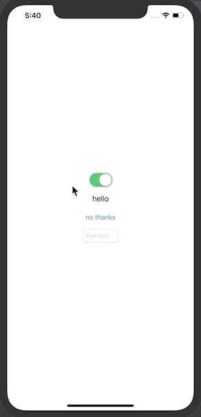

#  Handle some Text in UIKit for different language

## Ability

1. Handle  `.tsv` file which value in pair, in single line.
2. Assign key in Interface builder, like `.storyboard`, `.xib` file.
3. Change all UI object text by only  `LocalizedManager.shared.change(setting:)`

## Usage:

1. Add `_Language_.tsv` into Bundle
2. Add case in `enum Language`, make sure system code is related.
3. Give `localizedKey` in Interface builder for each UILabel, UIButton, UITextfield
4. Change `LocalizedManager.shared.change(setting:)` in proper way

## todo:

* [ ]: to SPM
